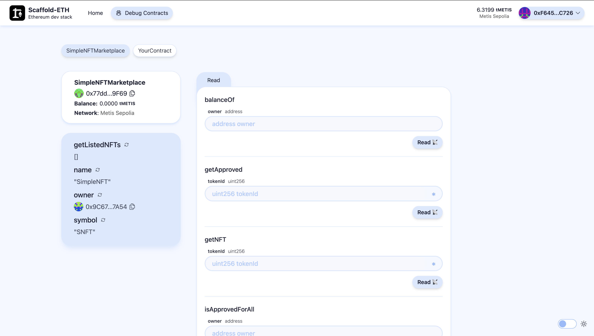

# 🏗 Scaffold-ETH 2 (Metis Edition)

<h4 align="center">
  <a href="https://docs.scaffoldeth.io">Documentation</a> |
  <a href="https://scaffoldeth.io">Website</a>
</h4>

🧪 An open-source, up-to-date toolkit for building decentralized applications (dapps) on the Ethereum blockchain, now tailored for the **Metis** ecosystem. It's designed to make it easier for developers to create and deploy smart contracts and build user interfaces that interact with those contracts.

⚙️ Built using NextJS, RainbowKit, Foundry/Hardhat, Wagmi, Viem, and Typescript.

- ✅ **Contract Hot Reload**: Your frontend auto-adapts to your smart contract as you edit it.
- 🪝 **[Custom hooks](https://docs.scaffoldeth.io/hooks/)**: Collection of React hooks wrapper around [wagmi](https://wagmi.sh/) to simplify interactions with smart contracts with TypeScript autocompletion.
- 🧱 [**Components**](https://docs.scaffoldeth.io/components/): Collection of common web3 components to quickly build your frontend.
- 🔥 **Burner Wallet & Local Faucet**: Quickly test your application with a burner wallet and local faucet.
- 🔐 **Integration with Wallet Providers**: Connect to different wallet providers and interact with the Ethereum network.



---

## Requirements

Before you begin, ensure you have the following tools installed:

- [Node (>= v18.18)](https://nodejs.org/en/download/)
- Yarn ([v1](https://classic.yarnpkg.com/en/docs/install/) or [v2+](https://yarnpkg.com/getting-started/install))
- [Git](https://git-scm.com/downloads)

---

## Quickstart

### Step-by-Step Instructions:

1. **Install the latest version of Scaffold-ETH 2**

   ```bash
   npx create-eth@latest
   ```

   This command will install all the necessary packages and dependencies. It might take some time, so please be patient.

   > **Note**: You can initialize your project with specific features or starter kits using extensions. Learn more in the [extensions documentation](https://docs.scaffoldeth.io/extensions/).

2. **Install dependencies**

   Before running any commands, install all required dependencies:

   ```bash
   yarn install
   ```

3. **Generate account and setup password**

   Run the following command to generate a new account for deployments:

   ```bash
   yarn generate
   ```

   Follow the prompts to set up your password for securing private keys.

4. **Run a local network (optional)**

   To test locally using Hardhat, start a local Ethereum network:

   ```bash
   yarn chain
   ```

5. **Deploy contracts**

   **For Metis Sepolia Testnet**:

   ```bash
   yarn deploy --network metisSepolia
   ```

   **For Hardhat Local**:

   ```bash
   yarn deploy
   ```

6. **Start the frontend**

   Launch the Next.js application:

   ```bash
   yarn start
   ```

   Visit your app at `http://localhost:3000` to interact with your smart contracts using the `Debug Contracts` page.

---

## Contract Functions

This project includes a sample NFT marketplace contract. Below is a breakdown of its main functionality:

### **1. Mint a new NFT**
   - **Function**: `mintNFT(string memory tokenURI)`
   - **Description**: Mints a new NFT with the provided metadata URI.
   - **Usage**: Call this function to create a new NFT.

### **2. List an NFT for Sale**
   - **Function**: `listNFT(uint256 tokenId, uint256 price)`
   - **Description**: Lists an NFT for sale at the specified price. The NFT is transferred to the contract for custody until sold or delisted.
   - **Requirements**: The sender must own the NFT.

### **3. Buy an NFT**
   - **Function**: `buyNFT(uint256 tokenId)`
   - **Description**: Purchases an NFT listed for sale by paying the listed price.
   - **Requirements**: Send the exact ETH amount specified by the seller.

### **4. Delist an NFT**
   - **Function**: `delistNFT(uint256 tokenId)`
   - **Description**: Removes an NFT from the marketplace, returning it to the seller.
   - **Requirements**: Only the seller can delist their NFT.

### **5. View NFT Details**
   - **Function**: `getNFT(uint256 tokenId)`
   - **Description**: Retrieves details about a specific NFT, including its price, seller, and listing status.

### **6. Get All Listed NFTs**
   - **Function**: `getListedNFTs()`
   - **Description**: Returns an array of all NFTs currently listed for sale on the marketplace.

---

## Local Development Workflow

1. Run a local Hardhat network:

   ```bash
   yarn chain
   ```

2. Deploy your contracts:

   ```bash
   yarn deploy
   ```

3. Start the Next.js application:

   ```bash
   yarn start
   ```

---

## Documentation

Visit the [official documentation](https://docs.scaffoldeth.io) for detailed technical guides and features of Scaffold-ETH 2.

---